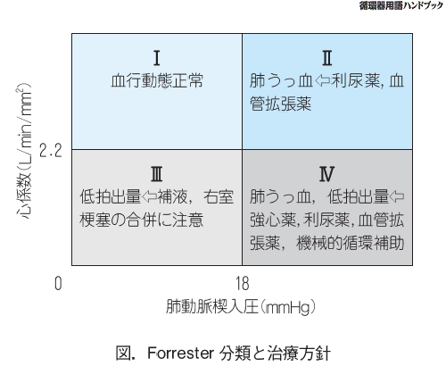

[一覧に戻る](../README.md)

# C:循環器

* [基本](#基本)
    * [圧の正常値](#圧の正常値)
* [心不全](#心不全)
    * [左心不全](#左心不全)
    * [右心不全](#右心不全)
    * [心不全の治療](#心不全の治療)
        * [急性心不全](#急性心不全)
        * [慢性期](#慢性期)
            * [IABP](#iabp)
* [不整脈](#不整脈)
    * [発作性上室性頻拍PSVT](#発作性上室性頻拍psvt)
    * [WPW](#wpw)
    * [心室頻拍](#心室頻拍)
    * [longQT](#longqt)
    * [AF](#af)
    * [VF](#vf)
    * [Brugada](#brugada)
    * [SSS](#sss)
    * [AVblock](#avblock)
    * [脚ブロック](#脚ブロック)
* [虚血性心疾患](#虚血性心疾患)
    * [狭心症](#狭心症)
        * [労作性狭心症](#労作性狭心症)
        * [冠攣縮性狭心症](#冠攣縮性狭心症)
        * [不安定狭心症](#不安定狭心症)
    * [ACS](#acs)
        * [急性心筋梗塞](#急性心筋梗塞)
* [心弁膜症](#心弁膜症)
    * [MS](#ms)
    * [MR](#mr)
    * [MVP](#mvp)
    * [AS](#as)
    * [AR](#ar)
* [先天性心疾患](#先天性心疾患)
    * [ASD](#asd)
    * [VSD](#vsd)
    * [Eisenmerger](#eisenmerger)
    * [房室中隔欠損](#房室中隔欠損)
    * [PDA](#pda)
    * [TOF](#tof)
    * [大動脈狭窄症](#大動脈狭窄症)
    * [肺動脈狭窄症](#肺動脈狭窄症)
    * [完全大血管転位](#完全大血管転位)
    * [三尖弁閉鎖症](#三尖弁閉鎖症)
    * [Ebstein奇形](#ebstein奇形)
    * [総肺静脈還流異常症](#総肺静脈還流異常症)
* [心内膜症](#心内膜症)
    * [感染性心内膜炎](#感染性心内膜炎)
    * [心臓粘液腫](#心臓粘液腫)
* [心筋疾患](#心筋疾患)
    * [心筋症](#心筋症)
        * [拡張型心筋症](#拡張型心筋症)
        * [肥大型心筋症](#肥大型心筋症)
    * [急性心筋炎](#急性心筋炎)
* [心膜疾患](#心膜疾患)
    * [急性心膜炎](#急性心膜炎)
    * [心タンポナーデ](#心タンポナーデ)
    * [収縮性心膜炎](#収縮性心膜炎)
* [動脈疾患](#動脈疾患)
    * [大動脈瘤](#大動脈瘤)
    * [大動脈解離](#大動脈解離)
    * [AAE](#aae)
    * [高安動脈炎](#高安動脈炎)
    * [急性動脈閉塞症](#急性動脈閉塞症)
    * [慢性動脈閉塞症](#慢性動脈閉塞症)
        * [閉塞性血栓性血管炎](#閉塞性血栓性血管炎)
        * [ASO](#aso)
* [静脈疾患](#静脈疾患)
    * [DVT](#dvt)
    * [下肢静脈瘤](#下肢静脈瘤)
    * [上大静脈症候群](#上大静脈症候群)
    * [リンパ浮腫](#リンパ浮腫)
* [血圧異常](#血圧異常)
    * [高血圧](#高血圧)
        * [本態性高血圧](#本態性高血圧)
        * [二次性高血圧](#二次性高血圧)
        * [悪性高血圧](#悪性高血圧)
    * [起立性調節障害](#起立性調節障害)
* [その他](#その他)
    * [大動脈弁輪拡張症](#大動脈弁輪拡張症)

[一番上へ](#c:循環器)
## 基本
房室結節は右冠動脈から
高K血症:刈り上げテントで長くクラス北京  

### 圧の正常値
* 左室
    * 拡張 < 12
    * 収縮 < 140
* 右室
    * 15 < 収縮 < 30
    * 拡張 < 12
* 中心静脈
    * 4 <  < 8  

[一番上へ](#c:循環器)
## 心不全
酸素需要を満たすだけの循環血液量を維持できない状態.  
心臓の後方にうっ滞がおきる.  
高拍出性心不全は抹消での酸素の需要があがりまくって,心拍出量が増加していても追いつかない状態.(甲状腺機能亢進症,動静脈シャント,重症貧血)
### 左心不全
左心系の機能不全により,全身の血流低下と肺水腫をおこす.  
* 肺うっ血
    * 発作性夜間呼吸困難
    * 呼吸性喘鳴
    * 起坐呼吸
    * ピンク色泡沫状痰
    * Cheyne-Stokes呼吸
* 聴診
    * Ⅲ音,Ⅳ音
    * 断続性ラ音@肺
* Xp
    * butterfly shadow
    * Kerley's B line
* 原因
    * 心筋疾患
    * 虚血性心疾患
    * 不整脈
    * 僧帽弁疾患
    * 後負荷(高血圧,大動脈弁疾患,AS)

### 右心不全
右心系の機能不全から全身に浮腫をきたす  
* 静脈うっ血
    * 頸静脈怒張(収縮性心膜炎,上大静脈症候群,TR,TS,心タンポ)
    * 肝腫大
    * 下肢･陰嚢浮腫
    * 漏出性胸水
    * 腹水
* 検査
    * 心エコー
    * 中心静脈圧CVP>10っmmHg
* 原因
    * COPD
    * 心タンポ
    * ASD
    * 肺高血圧
    * PS
    * TR
    * 収縮性心膜炎
    * 右室梗塞

### 心不全の治療
基本は安静,塩分の摂取制限,酸素投与  
#### 急性心不全
Forester分類に基づき治療する

#### 慢性期
利尿薬,ACEblocker,ARB,βblocker(急性期には禁忌),ジギタリス(AFがあるときに)
##### IABP
内科的治療抵抗性の,急性心不全,心原性ショックに適応がある.  
大動脈解離には禁忌

[一番上へ](#c:循環器)
## 不整脈
* 頻脈性:治療は迷走神経,アブレーション,除細動
    * 上室性
        * 心房期外収縮
        * 発作性上室頻拍
        * 心房粗動
        * 心房細動
    * 心室性
        * 心室期外収縮:経過観察
        * 心室頻拍
        * 心室粗動
        * 心室細動
* 徐脈性:治療はアトロピン,β刺激薬,ペースメーカー
    * 刺激産生低下
        * SSS
    * 刺激伝導低下
        * AVblock
* その他
    * WPW
    * LGL

脈拍異常をきたすもの
|    脈    |                                 疾患                                 |
| :------: | :------------------------------------------------------------------: |
|   頻脈   |       発熱,貧血,脱水,ショック(心原性,敗血症),甲状腺機能亢進症        |
|   徐脈   | SSS,濃厚更新,甲状腺機能低下症,閉塞性黄疸,ショック(神経),迷走神経刺激 |
|   大脈   |                       AR,PDA,AVshunt,動脈硬化                        |
|   小脈   |                           AS,心タンポ,VSD                            |
|   速脈   |                  甲状腺機能亢進症,発熱,貧血,AR,PDA                   |
|   遅脈   |                                  AS                                  |
|   奇脈   |                     心タンポ,肺性心,収縮性心膜炎                     |
| 二峰性脈 |                                 HCOM                                 |

抗不整脈薬の分類
鍋かりるか一気にプロ自身に上がって,リードは室になって,プラレール2両で網持ったベジータの上

1. NaCh阻害
    * 1a:上室性,心室性
        * キニジン
        * プロカインアミド
        * ジソピラミド
    * 1b:心室性
        * リドカイン
    * 1c:上室性,心室性
        * フレカイニド
1. β遮断薬:上室性,心室性
    * プロプラノロール
1. Kチャネル遮断:心室頻拍,心室細動
    * アミオダロン
    * ソタロール
1. Ca拮抗薬:上室性
    * ベラパミル
    * ジルチアゼム

適応系  
* 除細動
    * 心室細動
    * 無脈性心室頻拍
    * 多形性心室頻拍
* 恒久的ペースメーカー
    * 完全房室ブロック
    * Mobitz二型
    * SSS
* ICD
    * 持続性心室頻拍,心室細動
    * 非持続性心室頻拍(心機能低下例)
    * 原因不明の失神既往歴
    * Brugada,先天性QT延長症候群

### 発作性上室性頻拍PSVT
心房内にリエントリー回路が成立し頻脈を示す.  
* 原因  
    * WPW
    * 虚血性心疾患
    * ジキタリス中毒
    * 低K血症
* 検査
    * 幅の狭いQRS
    * 140~220/minの規則正しい波
* 治療
    * 迷走神経刺激
    * ATP
    * Ca拮抗薬(ベラパミル)
    * アブレーション

### WPW
Kent束があるやつ.発作性AFを起こす.  
* 症状
    * 発作維持の胸痛,動悸
    * 急死
* 検査
    * PQ短縮:0.12S
    * デルタ波
    * QRS延長:0.1S
    * 発作性AFのときにpseudoVTがおきる.
* 治療
    * 発作がなければ経過観察
    * PSVTには迷走神経刺激
    * 発作性AFをに対してはIa抗不整脈薬
    * 再発予防はアブレーション
    * ジキタリス,Ca拮抗薬は正常伝導路を阻害するので発作時には禁忌

### 心室頻拍
* 原因
    * 虚血性心疾患
    * 心筋症
    * 低K血症
    * QT延長症候群
* VFに移行しやすい
* 検査診断
    * 幅広く変形したQRS波が規則的に連続して出現する
* 治療
    * アミオダロンが第一選択
    * ショックの場合
        * カルディオバージョン
        * 除細動
    * ジキタリスは禁忌
    * 慢性期はICD

### longQT
QT/√RR>0.48S   
* 先天性
    * 常染色体劣性遺伝:聾唖をともなうもの. Jervell and Lange-Nielsen症候群
    * 常染色体優性遺伝:聾唖をともなわないもの.  Romano-Ward症候群
    * 治療
        * β遮断薬で予防
        * ハイリスクはICD
        * イソプロテレノールは禁忌
* 後天性
    * 薬剤
    * 電解質
        * K
        * Mg
        * Ca
    * 徐脈
    * 治療
        * 発作時には硫酸マグネシム,ペーシング
        * ペーシングまではイソプロテレノール(βブロッカー)を用いる
        * ICDの適応あり.
        * 治療:Ia,Ⅲ郡抗不整脈薬は禁忌 
* 多形性心室頻拍を合併するとVFに移行する
* 症状
    * 動悸
    * めまい
    * 失神発作(Adams-Stokes)
* torsade de pointesと呼ばれる多形性心室頻拍
    
### AF
心房内のf波が心室に伝わる.  
高齢者,MS,MR,ASDに起こりやすい.  
ADでは左房内に血栓を生じやすい.  
* 症状
    * 胸痛,動悸
* 検査
    * f波
    * RR感覚は不正
* 原因
    * 心房負荷に起因するもの（MS，MR，ASD）
    * 高血圧性心疾患
    * 高齢者
    * 糖尿病
    * 甲状腺機能亢進症
    * 虚血性心疾患，心不全
    * ．収縮性心膜炎，拡張型心筋症，肥大型心筋症
    * WPW発作時（→重症化）
* 治療
    * 抗凝固
        * CHADS2スコア
            * Congestive heart failur
            * Hypertention
            * Age
            * Diabetes
            * Storoke(2点)
    * 血行動態
        * 血行動態が不安定なら:プロカインアミド
        * 血行動態が安定なら
            * βブロッカー
            * Ca拮抗薬
            * ジキタリス
    * 治療抵抗性
        * アブレーション

### VF
電気的除細動  
CRP,エピネフリン,バソプレシン  
全く不規則な波  

### Brugada
突然VFを起こす.  
非発作時に不完全右脚ブロック+ST上昇+J波  
ICDの適応  
薬はない.  

### SSS
* 分類
    * Ⅰ郡:洞徐脈
    * Ⅱ郡:洞停止
* 症状
    * 失神(Adams-Stokes)
* 治療
    * 眼前暗黒感→ペースメーカー
    * 一過性
        * アトロピン
        * イソプロテレノール

### AVblock
* 器質的原因
    * 心サルコイドーシス
    * 心アミロイドーシス
    * 急性心筋炎
* 症状
    * Adams-Stokes
* 分類
    * Ⅰ度:0.2秒以上のPR延長
    * Wenckenbach:PR間隔が次第に延長してQRS脱落
    * Mobitz2型:PR間隔は延長せず,いきなりQRS脱落(ペースメーカーの適応)
    * 完全房室ブロック(ペースメーカーの適応)
* 治療
    * 急性期
        * ペーシング
        * アトロピン
        * β刺激薬(イソプロテレノール)
    * Ⅰ型,Weckenbach型:無症状なら経過観察
    * MobitzⅡ型,完全房室ブロック:ペースメーカー
    * ジギタリス,β遮断薬,ベラパミル,ジルチアゼムは禁忌

### 脚ブロック
* 右脚ブロック
    * 大きな影響はない
    * wide QRS,幅広いS波,陰性T波
* 左脚ブロック
    * やばい
    * wideQRS
    * Rに分裂

[一番上へ](#c:循環器)
## 虚血性心疾患
心筋の需要をみたす酸素を送れない
### 狭心症
ST低下,NOが有効
#### 労作性狭心症
運動負荷心電図  
発作時:NO舌下投与  
非発作時:Ca拮抗薬,β遮断薬,アスピリン  
PCI,CABG

#### 冠攣縮性狭心症
Holter心電図  
夜間,早朝  
発作時にST上昇を伴うものを異型狭心症  
誘発試験:過換気,ACh注入  
NO,Ca拮抗薬  
β遮断薬は禁忌(攣縮を励起する.)  
アルコール依存症が誘引になる.  

#### 不安定狭心症
最近二ヶ月以内に発症し心筋梗塞にいきそうなやつ.  
運動負荷テストは禁忌.  
即入院  
硝酸薬,Ca拮抗薬,β遮断薬,ヘパリン,アスピリン  
PCI,CABG,IABP
### ACS
アテロームの急激な破綻による不安定狭心症+急性心筋梗塞+心臓突然死の総称  
悪心を伴う胸痛,肩への放散痛,冷や汗
#### 急性心筋梗塞
右冠動脈で下壁梗塞  
心室瘤でST上
https://ja.wikipedia.org/wiki/%E3%83%89%E3%83%AC%E3%82%B9%E3%83%A9%E3%83%BC%E7%97%87%E5%80%99%E7%BE%A4

[一番上へ](#c:循環器)
## 心弁膜症
### MS
### MR
### MVP
### AS
失神,胸痛,心不全  

### AR
Quincke兆候:爪のところで拍動がでる.  
脈圧の増大  

[一番上へ](#c:循環器)
## 先天性心疾患
### ASD
### VSD
### Eisenmerger
### 房室中隔欠損
### PDA
### TOF
### 大動脈狭窄症
### 肺動脈狭窄症
### 完全大血管転位
### 三尖弁閉鎖症
### Ebstein奇形
### 総肺静脈還流異常症

[一番上へ](#c:循環器)
## 心内膜症
### 感染性心内膜炎
* Osler結節
* Roth班(眼底
* 爪のところの出血  
* 脳動脈瘤

### 心臓粘液腫
発熱ある.

[一番上へ](#c:循環器)
## 心筋疾患
### 心筋症
#### 拡張型心筋症
交互脈  
ギャロップリズム  
MRになる.  

#### 肥大型心筋症
MRの合併,突然死を起こしうる.  
失神,収縮期駆出性雑音  
僧帽弁の収縮期前方運動.  
二峰性頸動脈波  
巨大陰性T波  
錯綜配列  
静脈還流の増加で症状が改善する.  
* 禁忌
    * β刺激薬
    * ニトログリセリン
    * ジキタリス
    * 利尿薬

### 急性心筋炎
コックサキ-Bとか.  
感冒の先行  
心筋壊死の所見  
不整脈で死にうる.  
NSAIDSは禁忌
これは左心不全が主  

[一番上へ](#c:循環器)
## 心膜疾患
### 急性心膜炎
Dressler症候群  
心膜摩擦音:収縮期も拡張期も聞こえる高調音  
ST上昇をみる.  
* 胸痛
    * 座位で軽減
    * 吸気,仰臥位で増強  
* 治療は
    * NSAIDS
### 心タンポナーデ
奇脈:吸気時に血圧が10mmHg以上下がる.  

### 収縮性心膜炎
Kusmaul兆候  
dip and platou  
心膜ノック音  
右心不全が主
結核が多い.  

[一番上へ](#c:循環器)
## 動脈疾患
### 大動脈瘤
### 大動脈解離
### AAE
### 高安動脈炎
### 急性動脈閉塞症
### 慢性動脈閉塞症
#### 閉塞性血栓性血管炎
burger病,20-40代  
ステロイドは使わない.
#### ASO
全層性の炎症  
糖尿病が20%  
喫煙ダメ絶対

[一番上へ](#c:循環器)
## 静脈疾患
### DVT
### 下肢静脈瘤
### 上大静脈症候群
### リンパ浮腫

[一番上へ](#c:循環器)
## 血圧異常
### 高血圧
#### 本態性高血圧
#### 二次性高血圧
#### 悪性高血圧
### 起立性調節障害

[一番上へ](#c:循環器)
## その他
### 大動脈弁輪拡張症
* 病態
    * 上行大動脈基部の動脈瘤様拡大
    * 動脈弁輪拡大
* 症状
    * 弁輪拡大により，大動脈閉鎖不全
* 誘因
    * Marfan症候群など 
* 所見
    * AR所見，
    * 上行大動脈起始部の解離性動脈瘤などの合併
    * 上行大動脈の拡大
    * 上行大動脈から左室への造影剤の逆流を認める
* 治療
    * 大動脈弁置換＋上行大動脈graft＋冠動脈バイパス（Bentall手術）