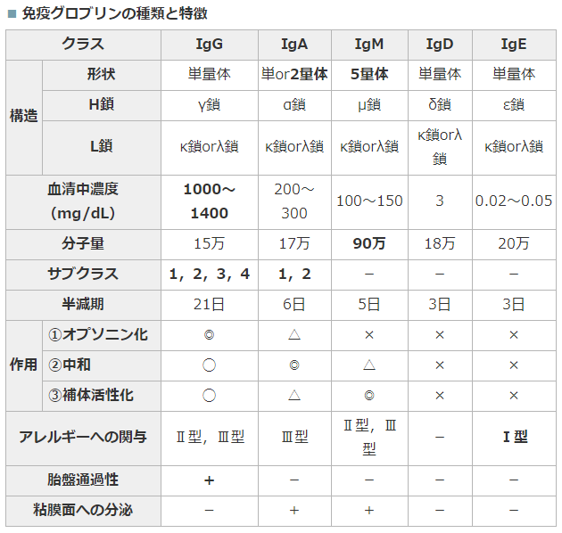
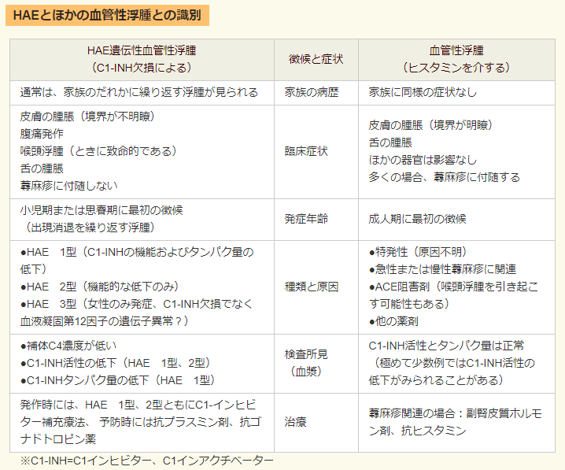

[一覧に戻る](../README.md)

# F:免疫アレルギー

* [基本](#基本)
    * [サイトカイン](#サイトカイン)
        * [種類ごと](#種類ごと)
        * [効果ごと](#効果ごと)
    * [Th細胞のまとめ](#th細胞のまとめ)
    * [免疫グロブリンまとめ](#免疫グロブリンまとめ)
* [免疫不全](#免疫不全)
    * [SCID](#scid)
    * [X連鎖(Bruton型)無γグロブリン血症](#x連鎖(bruton型)無γグロブリン血症)
    * [DiGeroge](#digeroge)
    * [Wiskott-Aldrich](#wiskott-aldrich)
    * [毛細血管拡張性失調症](#毛細血管拡張性失調症)
    * [Chediak-Higashi](#chediak-higashi)
    * [慢性肉芽種症](#慢性肉芽種症)
* [アレルギー](#アレルギー)
    * [遺伝性血管性浮腫](#遺伝性血管性浮腫)
    * [食物依存性運動誘発アナフィラキシー](#食物依存性運動誘発アナフィラキシー)
* [膠原病](#膠原病)
    * [抗体まとめ](#抗体まとめ)
    * [皮膚まとめ](#皮膚まとめ)
    * [肺・腎まとめ](#肺・腎まとめ)
    * [RA](#ra)
    * [若年性特発性関節炎（若年性関節リウマチ）](#若年性特発性関節炎（若年性関節リウマチ）)
    * [成人Still病](#成人still病)
    * [Felty症候群](#felty症候群)
    * [SLE](#sle)
    * [抗リン脂質抗体症候群](#抗リン脂質抗体症候群)
    * [SSc](#ssc)
    * [PM/DM](#pm/dm)
    * [Sjogren](#sjogren)
    * [MCTD](#mctd)
* [膠原病類縁疾患](#膠原病類縁疾患)
    * [リウマチ熱](#リウマチ熱)
    * [リウマチ性多発筋痛症](#リウマチ性多発筋痛症)
    * [Bechet](#bechet)
    * [強直性脊椎炎](#強直性脊椎炎)
    * [kawasaki desease](#kawasaki desease)
* [動脈炎](#動脈炎)
    * [川崎病](#川崎病)
    * [側頭動脈炎](#側頭動脈炎)
    * [結節性多発動脈炎](#結節性多発動脈炎)
    * [顕微的多発血管炎](#顕微的多発血管炎)
    * [EGPA(Churg-Strauss)](#egpa(churg-strauss))
    * [GPA(Wegner)](#gpa(wegner))
* [その他](#その他)
    * [Weber-Christain](#weber-christain)
    * [IgG4関連疾患](#igg4関連疾患)
    * [Reiter](#reiter)

[一番上へ](#f:免疫アレルギー)
## 基本

* 貪食能をもつもの
    * 樹状細胞
    * マクロファージ
    * 単球
    * 好中球
* 抗原提示細胞
    * B細胞
    * 樹状細胞
    * マクロファージ

### サイトカイン
まとめるのめんどいので[こちら](http://medi.atsuhiro-me.net/entry/2012/11/17/044300)を参照
#### 種類ごと

* インターロイキン(IL):白血球が分泌する．
* ケモカイン:白血球の遊走を制御する．
* インターフェロン(IFN):異物が侵入した際に分泌される．抗ウイルス作用が主．
* 造血因子 (CSF):血液細胞・免疫細胞の増殖・分化を支持する．G-CSF, M-CSF, エリスロポエチン
* 細胞増殖因子:EGF, FGF, TGFなど
* 細胞壊死因子 (TNF):細胞死を誘導=TNF-α, TNF-β

#### 効果ごと

* 炎症を誘導:樹状細胞・マクロファージが分泌
    * TNF-α
    * IL-1
    * IL-6
    * IL-12
    * IFN-γ
* 炎症を抑制:いずれもTh1細胞の分化を抑制
    * IL-4
    * IL-10
    * IL-13
* 白血球の分化・増殖 (ヘルパーT細胞が分泌)
    * IL-2:T細胞の増殖
    * IL-4:Th2細胞の分化
* 貪食細胞の活性化 (ヘルパーT細胞が分泌)
    * IFN-γ:マクロファージの活性化
    * IL-5:好酸球の活性化

### Th細胞のまとめ
まとめるのめんどいので[こちら](http://medi.atsuhiro-me.net/entry/2012/11/17/044300)を参照

* Th1
    * IL-12によって分化しIL-2, IFN-γ, TNF-αなどを分泌
    * CTL(細胞傷害性Ｔ細胞)やNK細胞による細胞性免疫を活性化
    * 細胞内寄生細菌やウイルスに感染した細胞の処分
* Th2
    * IL-4によって分化しIL-4, IL-6, IL-5, IL-13などを分泌
    * B細胞による液性免疫を活性化
    * 寄生虫や細胞外の細菌を排除
* Th17
    * TGF-βとIL-6の２つによって分化しIL-17, IL-2, IL-6, TNF-αなどを分泌 
    * 炎症を誘導する．
* Treg (制御性T細胞)
    * TGF-βによって分化しIL-10, TGF-βなどを分泌
    * 免疫反応を抑制する．

### 免疫グロブリンまとめ

[一番上へ](#f:免疫アレルギー)
## 免疫不全

* 原発性免疫不全
    * SCID
    * X連鎖無γグロブリン血症
    * DiGeorge
    * Wiskot-aldrich
    * 毛細血管拡張性失調症
    * Chediak-Higashi
    * 慢性肉下種症
* 続発性免疫不全
    * AIDS
    * ステロイド

### SCID
AR or XR  
T,Bcellの分化異常（ADAの欠損）  
幼少期に発症  
造血幹細胞移植

### X連鎖(Bruton型)無γグロブリン血症
XR  
B細胞の異常（母親由来のIgGが消える6か月以降に発症）  
グロブリン製剤，抗菌薬

### DiGeroge
AD or de novo : 22q11.2
鰓弓の発生異常＝胸腺，副甲状腺の発達障害  
T細胞の異常  
低Ca血症，テタニー  
VSD，Fallot等の心奇形  
感染予防，Ca投与(テタニー)

### Wiskott-Aldrich
伴性劣性遺伝  
T,B細胞系の機能不全 + 血小板減少 + アトピー性湿疹  
検査：血小板↓，IgM↓，IgA↑，IgE↑  
T細胞は数も減る．  
造血幹細胞移植

### 毛細血管拡張性失調症
常染色体劣性遺伝  

* T，B細胞の機能異常
* 進行性小脳失調運動  
* 血管拡張症  

感染対策（生ワクチンの接種は禁忌

### Chediak-Higashi
常染色体劣性  
* 好中球の異常：遊走能↓，殺菌能↓
* 血小板：出血傾向
* メラニン：部分的白子症，光線過敏
* すべての顆粒球に巨大顆粒が見られる.

巨大ペルオキシダーゼ顆粒
造血幹細胞移植を幼児期までに，ST合材

### 慢性肉芽種症
伴性劣性遺伝  
食細胞の活性酸素産生障害 
黄色ブドウ球菌（カタラーゼ菌）がやばい  
NBT色素還元試験  
幹細胞移植，感染対策（生ワクチンは禁忌

[一番上へ](#f:免疫アレルギー)
## アレルギー
* 液性免疫
    * Ⅰ型：即時型＝RASTで検索
        * アナフィラキシー
        * 気管支喘息
        * アレルギー性鼻炎
        * 蕁麻疹
    * Ⅱ型：細胞障害型＝Coombs試験とか
        * [Goodpasture](respiratory.md#goodpasture)
        * [AIHA](hematopoietic.md#aiha)
        * ABO不適合輸血
        * ITP
        * 橋本病
        * [SLE（Ⅲも）](#SLE)
    * Ⅲ型：免疫複合体＝Arthus反応，沈降反応
        * 血清病：発熱，皮膚症状，関節炎
        * RA
        * 急性糸球体腎炎
        * クリオグロビン血症
* 細胞性免疫 
    * Ⅳ型：遅延型＝パッチテスト，DLST
        * 接触性皮膚炎
        * ツベルクリン反応
        * 移植免疫（GVHD）
        * リンホカインがみられる

### 遺伝性血管性浮腫
C1インヒビターの先天欠損  
浮腫が特徴

### 食物依存性運動誘発アナフィラキシー
* 概要
    * 簡単にいうとアナフィラキシー
* 原因
    * 小麦
    * エビ
    * イカ
* 運動
    * 食後二時間
* 誘引
    * ステロイドで誘引される
* 治療
    * アドレナリンの
    * エピペン

[一番上へ](#f:免疫アレルギー)
## 膠原病

### 抗体まとめ

|           疾患           |                       特徴的自己抗体                       |  
| :----------------------: | :--------------------------------------------------------: |  
|    原発性胆汁性肝硬変    |                    抗ミトコンドリア抗体                    |  
|      自己免疫性肝炎      |                   抗核抗体，抗平滑筋抗体                   |  
|        Basedow病         |                    抗TSHレセプター抗体                     |  
|       慢性甲状腺炎       | 抗甲状腺抗体（抗サイログロブリン抗体，抗ミクロゾーム抗体） |  
| インスリン自己免疫症候群 |                      抗インスリン抗体                      |  
|    Goodpasture症候群     |                        抗基底膜抗体                        |  
|      Sjögren症候群       |                   抗SS-A抗体，抗SS-B抗体                   |  
|    皮膚筋炎（PM/DM）     |                         抗Jo-1抗体                         |  
|  全身性硬化症（強皮症）  |                        抗Scl-70抗体                        |  
|       関節リウマチ       |                抗CCP抗体，リウマトイド因子                 |  
|           SLE            |     抗ds-DNA抗体，抗Sm抗体，抗ヒストン抗体，抗SS-A抗体     |  
|       限局性強皮症       |                     抗セントロメア抗体                     |  
|     Wegener肉芽腫症      |           抗好中球細胞質抗体　PR3-ANCA（C-ANCA）           |  
|           MCTD           |                         抗RNP抗体                          |  
|         悪性貧血         |                抗胃壁細胞抗体，抗内因子抗体                |  
|   自己免疫性溶血性貧血   |                      直接クームス試験                      |  
|       重症筋無力症       |                 抗アセチルコリン受容体抗体                 |  
|    顕微鏡的多発血管炎    |           抗好中球細胞質抗体　MPO-ANCA（P-ANCA）           |  

### 皮膚まとめ

|          疾患          |                             皮膚                              |  
| :--------------------: | :-----------------------------------------------------------: |  
| 全身性エリテマトーデス |               蝶形紅斑，円板状皮疹，光線過敏症                |  
|        皮膚筋炎        | ヘリオトロープ疹，Gottron徴候，多形皮膚萎縮（ポイキロデルマ） |  
|         強皮症         |      近位皮膚硬化，強指症，指尖陥凹性瘢痕，爪上皮出血点       |  
|      関節リウマチ      |                       リウマトイド結節                        |  
|    結節性多発動脈炎    |              紫斑，皮膚潰瘍，皮下結節，網状皮斑               |  
|  抗リン脂質抗体症候群  |                           網状皮斑                            |  
|    混合性結合組織病    |                       ソーセージ様手指                        |  

### 肺・腎まとめ

|           肺症状・腎障害           | 考えられる膠原病（および類縁疾患 |  
| :--------------------------------: | :------------------------------: |  
|        間質性肺炎・肺線維症        |  SSc，PM/DM，RA，MCTD，MPA，SS   |  
|             肺高血圧症             |          MCTD，SLE，SSc          |  
|              肺胞出血              | MPA，GPA（Wegener肉芽腫症），SLE |  
|         好酸球性肺炎，喘息         |   EGPA（Churg-Strauss症候群）    |  
|          ネフローゼ症候群          |             SLEなど              |  
|            ループス腎炎            |               SLE                |  
|       半月体形成性糸球体腎炎       |          ANCA関連血管炎          |  
|             腎クリーゼ             |               SSc                |  
| 間質性腎炎（尿細管性アシドーシス） |                SS                |  

### RA
関節滑膜の炎症  
30-50の女性  
DIPは保たれる 
朝のこわばりと多発性関節炎   
* Xp
    * 軟骨下コツ破壊
    * 関節隙狭小化
* 抗体
    * RF
    * CCP抗体
* 合併症
    * 壊疽性膿皮症
    * Sjogren
    * 腎障害（アミロイドーシス）
* 関節外病変
    * 皮下結節
    * 胸膜炎
    * 間質性肺炎
    * 血管炎
* 治療
    * MTX －＞ 膜性腎症
    * NSAIDS
    * ステロイド
    * D-ペニシラミン

悪性関節リウマチ:進行性のRAに多い

|  臓器  |              症状              |
| :----: | :----------------------------: |
|   心   |        心膜炎，心筋梗塞        |
|   肺   |       胸膜炎，間質性肺炎       |
|   腎   |         急速進行性腎炎         |
| 消化器 | 腸間膜動脈血栓症（下血，穿孔） |
|  四肢  |  皮下結節，指趾壊疽，下腿潰瘍  |
|  神経  |          多発性神経炎          |
|   眼   |    上強膜炎（虹彩炎はまれ）    |

### 若年性特発性関節炎（若年性関節リウマチ）
16歳未満で６W以上の持続  
MMP-3が活動期に↑  
治療はNSAIDS，ステロイド，DMARDs  
難治例にはTNF阻害薬，抗IL-6抗体  
* 全身型（Still病）
    * 性差なし
    * 弛張熱
    * サーモンピンク皮疹
    * 肝脾腫
    * 心外膜炎
    * フェリチン↑
    * 抗核抗体(-)
    * RF(-)
* 関節型
    * 女性に多い
    * 抗核抗体（＋）
        * 多関節型：RF(＋）
        * 少関節型：虹彩毛様体炎

### 成人Still病
* 三徴
    * 発熱：弛張熱（スパイク型高熱）
    * 紅斑：サーモンピンク皮疹
    * 多発性関節炎

リンパ節腫大，肝脾腫，心膜炎  
フェリチン↑，白血球↑  
RF(-)，抗核抗体(-)
NSAIDS,ステロイド，生物学的製剤(難治例)  

### Felty症候群
* 関節リウマチ：RF(+)
* 脾腫：血小板→白血球→赤血球の順で汎血球減少を起こす．
* 白血球減少：易感染性

治療はDMARDs

### SLE
Ⅱ,Ⅲ型アレルギー  
* 全身症状
    * 発熱
    * 体重減少
* 皮膚症状
    * 蝶形紅斑
    * 光線過敏
    * 脱毛
    * 口腔潰瘍
    * ディスコイド疹
* 関節症状
    * 多発関節炎
    * 関節痛
    * Jaccoud変形
* 腎症状
    * ループス腎炎：ネフローゼ（なおらない）
* 精神症状，中枢神経症状（なおらない）
* 心膜炎
* Reynaud現象（30%）

汎血球減少，補体↓，抗ds-DNA抗体(+)，抗Sm抗体(+)    
補体と抗dsDNA抗体が活動性の評価に有用  
自己免疫性溶血  
治療はステロイド  
抗核抗体が一番感度が高い.

### 抗リン脂質抗体症候群
カルジオリピンなどに対する抗体  
SLEが基礎疾患にあることが多い  
* 症状
    * 動静脈血栓を起こす
        * TIA
        * SMA血栓
        * Budd-Chiari（肝静脈の閉塞による門脈圧亢進）  
    * 習慣流産（ワルファリン禁忌）  
    * 皮膚：リベド
* 検査所見
    * 抗体
        * ループスコアグラント
        * 抗カルジオリピン抗体
        * 抗核抗体
    * APTT延長，血小板数低下
    * 梅毒反応の擬陽性
* 治療
    * アスピリン，ワルファリン

参考[URL](hematopoietic.md#抗リン脂質抗体症候群)

### SSc
中年女性  
抗Scl-70抗体，抗RNP抗体    
* 初発症状
    * Reynaud現象
    * 浮腫性硬化
* 皮膚症状
    * 指のしょうかいよう
    * 毛細血管拡張
    * 色素沈着
    * 仮面用顔貌
    * 舌小帯短縮
* 骨，関節
    * 多発関節痛
    * 末節骨溶解
* 消化器症状（CREST）基本的には筋肉が置き換わって圧がぬける
    * 嚥下障害
    * 逆流性食道炎 
    * 吸収不良
    * このときはSCL-70が上がらない.
* 心,血管症状 → Ca拮抗薬，PGI
* 肺症状
    * 肺線維症
    * 肺高血圧症
* 腎症状
    * 悪性高血圧 ← ACE blocker

治療はステロイド

### PM/DM
女性に多い，二峰性のピーク  
悪性腫瘍（胃、肺）の合併  
間質性肺炎  
近位筋の萎縮  
* 皮膚
    * ヘリオトロープ疹
    * Gottoron
    * Raynaud
    * 多型皮膚萎縮
* 検査
    * CK,アルドラーゼ，LDH ↑↑
    * クレアチニン ↑
    * 筋電図における筋原生パターン
    * 筋肉にリンパ球浸潤
* 抗体
    * 抗Jo-1抗体 ⊂ 抗ARS抗体

治療はステロイド，免疫抑制

### Sjogren
中年女性に多い  
唾液腺，涙腺のリンパ球浸潤  
Schirmer試験，Rose Bengal試験，蛍光色素試験  
一型RTAの合併  
[PBC](HBP.md#PBC)の合併，一部で橋本病の合併
抗SS-A抗体(+)，抗SS-B抗体(+)
RF(+) ，抗核抗体(+)  

### MCTD
抗U1RNP抗体  
いろんあ奴の混在系

[一番上へ](#f:免疫アレルギー)
## 膠原病類縁疾患
### リウマチ熱
A群β溶連菌の感染  
* 多発関節炎
* 心炎 ← 僧帽弁
* 皮下結節
* 輪状紅斑 
* 小舞踏病

ASO(+)   
ペニシリン，アスピリン，ステロイド

### リウマチ性多発筋痛症
60歳以上の女性  
四肢近医の痛み  
[側頭動脈炎](#側頭動脈炎)の合併  
赤沈↑，CRP↑，筋電図・筋原性酵素に異常はない，抗体も陰性．  
ステロイド(いきなり大量投与する.)

### Bechet
急性の円s尿が起きる多臓器疾患  
HLA-B51の保有者  
* 難治性アフタ
* 皮膚症状
    * 結節性紅斑
    * 血栓性静脈炎
* 目症状
    * 前房蓄膿
    * ブドウ膜炎
* 有痛性外陰部潰瘍
* 他
    * 精巣上体炎
    * 消化器のうち抜型潰瘍
    * 中枢神経症状：髄膜炎様症状
    * 血管：動脈瘤，閉塞性血栓性静脈炎
* 治療
    * コルヒチン:眼病変の予防,皮膚症状  
    * ステロイド:血管病変,中枢神経病変  
    * インフリキシマブ

針反応(+)  
シクロスポリンとか

### 強直性脊椎炎
HLA-B27  
仙腸関節炎  
Bamboo Spine  
虹彩毛様体炎，大動脈弁閉鎖不全，AVblock  
NSAIDS

### kawasaki desease
乳幼児に見られる原因不明の急性熱  
冠動脈瘤  
* 診断基準
    * 1,痛い
    * 2,2個ある目の充血
    * 3,発熱3日以降の皮疹
    * 4,四肢の硬性浮腫,指先の潰瘍
    * 5,5日以上の発熱
    * 6,苺舌

[一番上へ](#f:免疫アレルギー)
## 動脈炎
### 川崎病
* 治療
    * アスピリン
    * ガンマグロブリン製剤
* 5日以上続く発熱 
* 再発率は2-3%多くない.
* 四肢末端の変化 
    * 急性期：
        * 手足の硬性浮腫
        * 掌蹠ないし四肢末端の紅斑 
    * 回復期：
        * 指先（爪皮移行部）からの膜様落屑 
* 不定形発疹（発熱後3〜4日に出現） 
* 両側眼球結膜の充血 
* 口唇の紅潮，苺舌，口腔咽頭結膜のびまん性発赤 
* 急性期における（有痛性）
    * 非化膿性頸部リンパ節腫脹 
* 〔参考条項〕 
    * 心血管系：
        * 聴診所見（心雑音，奔馬調律，微弱心音），ECG（PR時間，QT時間の延長，異常Q波，低電位，ST-Tの変化，不整脈），胸部X線（心陰影拡大），心エコー（心囊液貯留，冠動脈瘤（1〜2％）），狭心症症状，末梢動脈瘤（眼窩など） 
    * 消化管：
        * 下痢，嘔吐，腹痛，胆囊腫大，麻痺性イレウス，軽度の黄疸，血性トランスアミナーゼ↑ 
    * 血液：
        * 核の左方移動を伴うWBC↑，Plt↑，ESR↑，CRP（＋），Alb↓，α2グロブリン↑，軽度の貧血 
    * 尿：
        * 蛋白尿，軽度の白血球沈渣 
    * 皮膚：
        * BCG 接種部位の発赤・痂皮形成 
    * 呼吸器：
        * 咳嗽，鼻汁，肺野の異常陰影 
    * 神経：
        * 髄液中単核球↑，けいれん，意識障害，顔面神経麻痺，四肢麻痺

### 側頭動脈炎
大型の血管  
女性に多い  
[リウマチ性多発筋痛症](#リウマチ性多発筋痛症)の合併  
拍動性頭痛，顎跛行，視力障害（網膜中心動脈）  
ステロイド

### 結節性多発動脈炎
中型の動脈  
長期間の不明熱  
壊死性動脈炎の存在を病理でみとめる．
* 高血圧
* 筋痛
* 関節痛
* 腎障害 ← これで死ぬ
* 多発性単神経炎

### 顕微的多発血管炎
小型の血管 
MPO-ANCA（＋），RF(+)  
* 肺胞出血 ← 多い
* 急速進行性糸球体腎炎  ← 多い 
* 多発性単神経炎

### EGPA(Churg-Strauss)
小型の血管  
好酸球増多 ＋ 気管支喘息  
MPO-ANCA（＋）
肉芽種

### GPA(Wegner)
小型の血管  
PR3-ANCA(+)
肉芽種  
* 三徴
    * 難治性鼻炎 ← 鞍鼻
    * 肺の結節性病変 ← 空洞があることも
    * 腎炎 ← 半月体形成腎炎

[一番上へ](#f:免疫アレルギー)
## その他
### Weber-Christain
皮下組織に小結節性の脂肪織炎をおこし，圧痛を伴うものの総称  
膠原病に合併するものや本態性のものがある．

### IgG4関連疾患
### Reiter
尿道炎,RF(-)

