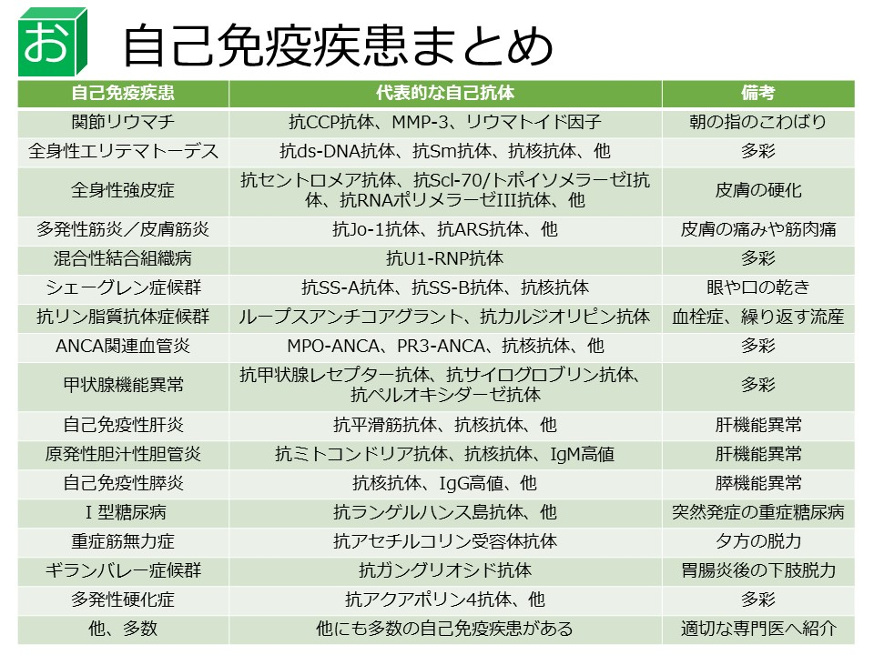

# 免疫・アレルギー

## 基本

* 貪食能をもつもの
    * 樹状細胞
    * マクロファージ
    * 単球
    * 好中球
* 抗原提示細胞
    * B細胞
    * 樹状細胞
    * マクロファージ

### サイトカイン
まとめるのめんどいので[こちら](http://medi.atsuhiro-me.net/entry/2012/11/17/044300)を参照
#### 種類ごと

* インターロイキン(IL):白血球が分泌する．
* ケモカイン:白血球の遊走を制御する．
* インターフェロン(IFN):異物が侵入した際に分泌される．抗ウイルス作用が主．
* 造血因子 (CSF):血液細胞・免疫細胞の増殖・分化を支持する．G-CSF, M-CSF, エリスロポエチン
* 細胞増殖因子:EGF, FGF, TGFなど
* 細胞壊死因子 (TNF):細胞死を誘導=TNF-α, TNF-β

#### 効果ごと

* 炎症を誘導:樹状細胞・マクロファージが分泌
    * TNF-α
    * IL-1
    * IL-6
    * IL-12
    * IFN-γ
* 炎症を抑制:いずれもTh1細胞の分化を抑制
    * IL-4
    * IL-10
    * IL-13
* 白血球の分化・増殖 (ヘルパーT細胞が分泌)
    * IL-2:T細胞の増殖
    * IL-4:Th2細胞の分化
* 貪食細胞の活性化 (ヘルパーT細胞が分泌)
    * IFN-γ:マクロファージの活性化
    * IL-5:好酸球の活性化

### Th細胞のまとめ
まとめるのめんどいので[こちら](http://medi.atsuhiro-me.net/entry/2012/11/17/044300)を参照

* Th1
    * IL-12によって分化しIL-2, IFN-γ, TNF-αなどを分泌
    * CTL(細胞傷害性Ｔ細胞)やNK細胞による細胞性免疫を活性化
    * 細胞内寄生細菌やウイルスに感染した細胞の処分
* Th2
    * IL-4によって分化しIL-4, IL-6, IL-5, IL-13などを分泌
    * B細胞による液性免疫を活性化
    * 寄生虫や細胞外の細菌を排除
* Th17
    * TGF-βとIL-6の２つによって分化しIL-17, IL-2, IL-6, TNF-αなどを分泌 
    * 炎症を誘導する．
* Treg (制御性T細胞)
    * TGF-βによって分化しIL-10, TGF-βなどを分泌
    * 免疫反応を抑制する．

## 免疫不全

* 原発性免疫不全
    * SCID
    * X連鎖無γグロブリン血症
    * DiGeorge
    * Wiskot-aldrich
    * 毛細血管拡張性失調症
    * Chediak-Higashi
    * 慢性肉下種症
* 続発性免疫不全
    * AIDS
    * ステロイド

### SCID
AR or XR  
T,Bcellの分化異常  
幼少期に発症  
造血幹細胞移植

### X連鎖(Bruton型)無γグロブリン血症
XR  
B細胞の異常（母親由来のIgGが消える6か月以降に発症）  
グロブリン製剤，抗菌薬

### DiGeroge
AD or de novo : 22q11.2
鰓弓の発生異常＝胸腺，副甲状腺の発達障害  
T細胞の異常  
低Ca血症，テタニー  
VSD，Fallot等の心奇形  
感染予防，Ca投与(テタニー)

### Wiskott-Aldrich
伴性劣性遺伝  
T,B細胞系の機能不全 + 血小板減少 + アトピー性湿疹  
検査：血小板↓，IgM↓，IgA↑，IgE↑  
造血幹細胞移植

### 毛細血管拡張性失調症
常染色体劣性遺伝  

* T，B細胞の機能異常
* 進行性小脳失調運動  
* 血管拡張症  

感染対策（生ワクチンの接種は禁忌

### Chediak-Higashi
常染色体劣性  
* 好中球の異常：遊走能↓，殺菌能↓
* 血小板：出血傾向
* メラニン：部分的白子症，光線過敏

巨大ペルオキシダーゼ顆粒
造血幹細胞移植を幼児期までに，ST合材

### 慢性肉芽種症
伴性劣性遺伝  
食細胞の活性酸素産生障害 
黄色ブドウ球菌がやばい  
NBT色素還元試験  
幹細胞移植，感染対策（生ワクチンは禁忌

## アレルギー
* 液性免疫
    * Ⅰ型：即時型＝RASTで検索
        * アナフィラキシー
        * 気管支喘息
        * アレルギー性鼻炎
        * 蕁麻疹
    * Ⅱ型：細胞障害型＝Coombs試験とか
        * Goodpasture
        * AIHA
        * ABO不適合輸血
        * ITP
        * 橋本病
        * SLE（Ⅲも）
    * Ⅲ型：免疫複合体＝Arthus反応，沈降反応
        * 血清病
        * RA
        * 急性糸球体腎炎
        * クリオグロビン血症
* 細胞性免疫 
    * Ⅳ型：遅延型＝パッチテスト，DLST
        * 接触性皮膚炎
        * ツベルクリン反応
        * 移植免疫（GVHD）

## 膠原病

### RA
関節滑膜の炎症
* 抗体
    * RF
    * CCP抗体
* 合併症
    * 