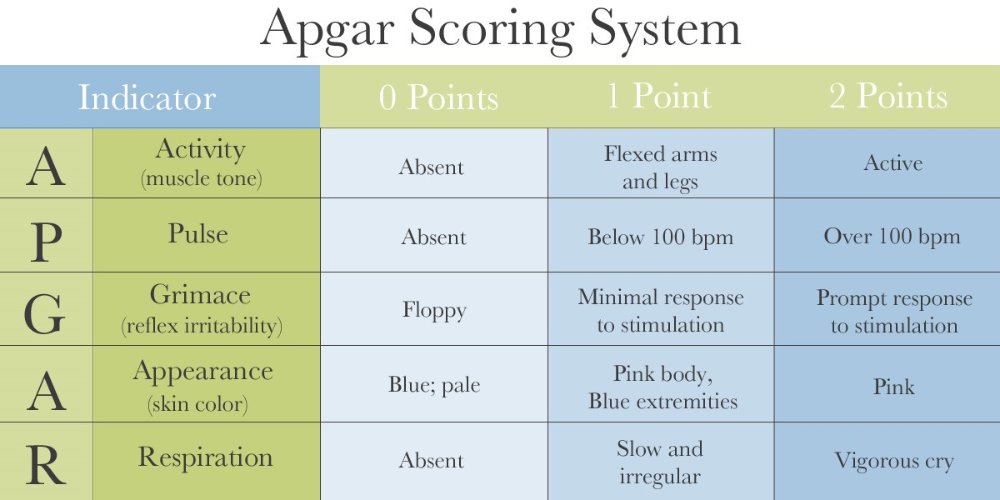

# 小児
## 総論
### 基本
* 新生児は4頭身

### 大泉門の異常
* 早期閉鎖症
    * Crouzun病
    * Apert症候群

### 頭囲増大
* 水頭症
* 先天異常
    * Tay-Sach病
    * Hurler病

### 歯がの発育
* 乳歯
    * 月齢-6
* 永久歯
    * 32本

### コツ発育
* 新生児のとき
    * 大腿骨遠位端,脛骨近位端の化骨 <ー クレチン症ではみられない
* 1歳移行
    * 手の骨の数 → 化骨核数=年齢~年齢+1
    * 最終的には手根骨は8個

### 反射
* 原始反射
    * Moroとか 
* 姿勢反射

### 夜尿
排尿のしつけは二歳ぐらいから  
5~6歳までの夜尿は生理的  
三環系抗うつ薬など

### 二次性徴
骨年齢によく相関する  
男は下から,女は上から

### 母乳
分娩3-5日のやつを初乳,10日移行を成熟乳  
* 初乳
    * 淡黄色
    * 免疫物質
    * タンパク質
    * エネルギー
    * 胎便排出を促進
    * 便はやわらかくなる
* 母乳のデメリット
    * ビタミンKは不足しがち
        * 1d,1w,1mに注射する.
    * 鉄も少ない

### 授乳
ちゃんとゲップさせること  

### 離乳
5-6ヶ月から半固形食で開始.  
12-18ヶ月で完了する  
卵白はNG.卵黄から

### 乳児死亡率
日本では2.3(対1000)  

### 新生児マススクリーニング
4-7日にやる,一番見つかるのはクレチン症  
* フェニルケトン尿症
* ホモシスチン尿症
* メープルシロップ尿
* ガラクトース血症

### SIDS
いきなり死ぬやつ.剖検でも不明.2-6月に好発.

### 乳児揺さぶられ症候群
硬膜下出血,硝子体出血

### 診察の手順
頭頸部は後回し(泣くから)

## 新生児
### 正常新生児
#### 出生前
ちゃんと検診
#### 出生直後
抗菌薬の点眼→淋菌,クラミジア
#### 出生当日
保温  
vitKの補充1d,1w,1m  
胎便:暗緑色,無菌,48時間以内にでる  
臍帯がおちるのは5-7日
### ハイリスク児
低出生体重児がやばい  

### 出生に伴う異常
#### 新生児仮死
* 分娩前
    * 胎盤機能不全
    * 胎児発育不全
    * 羊水過少
* 分娩
    * 羊水過少
    * 児頭骨盤不均衡
* 出生後
    * 先天異常
    * RDS

Apgar Score  
  
1分:新生児仮死の指標
5分:神経系のあれ

* 7-10:正常
* 4-6:軽症
* 0-3:重症

#### 低酸素性虚血性脳症
脳室周囲白質軟化症:在胎32w以下で生まれるときに血圧の変動とかがあると後遺症として脳性麻痺とかがおきる
#### 分娩障害
* 産瘤
    * 賛同抵抗による圧迫
    * 骨癒合を超える
    * 経過観察
    * ぶっちゃけ単なる浮腫
* 頭血腫
    * 経過観察
    * 徐々に大きくなる
    * 骨癒合を超えない
* 帽状腱膜下血腫
    * 導出静脈の破綻
    * 骨癒合を超える
    * 出血のマネジメント
    * 産後1ヶ月とか
    * 穿刺は禁忌

* 骨折:鎖骨
* 神経損傷:腕神経叢
    * 上位型:Erb → こっちが多い+Moroの消失
    * 下位型:Klumpke
### 呼吸障害
#### RDS
低体重児,糖尿病母体児  
肺サーファクタントの欠乏  
出生後2-3時間  
代謝性+呼吸性アシドーシス  
網状顆粒状陰影  
出生前にL/S比の測定  
CPAP+サーファクタントの散布  

#### TTN
肺の水の吸が収遅延する.陣痛発来前のカイザーに多い.O2投与  

#### MAS
胎便で汚染された羊水を胎内で吸収することにより起こる.  
正常胎児が低酸素状態に晒されっると迷走神経反射により排便がおきてしまう.  
過期産児におおく,早産児に少ない.  
出生時に羊水混濁  
レントゲンで無気肺と肺気腫を認める.  
重症では気道洗浄  

#### 無呼吸発作
20秒以上の呼吸停止.
呼吸中枢の未熟性による.  
早産児に起こりやすい.  

#### 新生児慢性肺疾患
O2投与等が必要な状態が28日以上つづくこと.  
低出生体重児におおい.  
Xpで無気肺と肺気腫の混在  
肺サーファクタントとかHFOとか
RDSの先行,絨毛膜羊膜炎等によって分類される
* BPD
    * RDSあり
    * 泡状気腫影なし
    * 人口換気による
* WMS
    * RDSなし
    * 泡沫状気腫影あり
    * 子宮内感染

### 新生児痙攣
頭部のエコーを大泉門のところからやる.  
原因
* 仮死
    * 頭蓋内出血
    * HIE
    * 脳奇形
* 感染症
* 代謝異常
    * 低血糖
    * 低Na
    * 低Ca
    * 低Mg
    * vitB6
    * 高bil

### 新生児低血糖
異常な甲高い声,チアノーゼ,無呼吸
### 新生児低カルシウム
母体からのCaがとぎれるため12-24時間で一旦さがる.  
正期産なら8mg/dl,早産なら7mg/dlで診断  
振戦をみとめる.グルコン酸Caの静注  

### vitK欠乏
母乳栄養児がリスク  
頭蓋内出血をきたす(遅発型)  
PIVKA-2が高地をしめす.  

### 新生児黄疸
#### 生理的黄疸
2-3にちから始まり5-6日でピーク  
HbFの破壊による関節Bilの上昇  

#### 病的黄疸
関節Bilの上昇は新生児のBBBを超えるので核黄疸を示す.  
核黄疸:最終的にアテトーゼ型脳性麻痺をおこす.  
光線療法がきく.  
### 新生児血液疾患
#### 溶血性疾患
* ABO式
* 遺伝性球状赤血球症
* G6PD
* サラセミア

など.黄疸
#### 未熟児貧血
未熟児は貧血をおこしやすい.  

### 新生児敗血症
母体ゆらいのIgGがなくなってくるとなる.
* 早発型
    * ~72H
    * GBS,大腸菌
    * 前期破水
    * アンピシリン+ゲンタマイシン
* 遅発型
    * 72H~
    * 黄色ブドウ球菌

## 染色体異常
### Down
21トリソミー,母体の高齢  
特徴的な顔つき  
精神発達遅滞  
Floppy infant  
AVSD,ASDなどの心奇形  
羊水検査できるよ!!  

### 18トリソミーEdwards
女児に多い.  
一年以内に死ぬことが多い.  
小額症  
揺り椅子状足底  
心奇形  

### 13トリソミー
全前脳胞症,多指症  

### 猫鳴き症候群(5p-症候群)
女児に多い.5pの欠損  
重度の精神発達遅滞

### Tunren
45X  
低身長,無月経,翼状頸  
エストロゲン↓,LH,FSH↓
心奇形もある.  

### Klienferter
47XXY
外性器は男性型,不妊  
耐糖能異常,精神発達遅滞  
テストステロン↓

## 消化管疾患
### 総論
#### 便秘
* 母乳不足
* クレチン症
* Hirschpuring
* 肛門裂傷

#### 下血
* 腸重積
* Meckel形質
* 腸回転異常

### 先天性食道閉鎖症
Gross C型(気管と交通してるやる)が一番おおい,  
羊水過多.  
初回哺乳後の嘔吐,  
ネラトンカテーテルのcoil up sign  
食道造影は禁忌  
外科手術  

### 新生児胃穿孔･胃破裂
台湾速側多い.  
saddle bag sign  

### 肥厚性幽門狭窄症
幽門輪の肥厚による.  
新生児の男児に多い.  
非胆汁性噴出性嘔吐  
オリーブ用腫瘤,  
低Cl性代謝性アルカローシス.  低K血症  
腹部エコーでdoughnut sign  
Xpでsingle bubble sign  
造影でString sign  
乳酸リンゲル液は禁忌.  

### 先天性十二指腸閉鎖
羊水過多をおこす.  
Down症  
胆汁性嘔吐  
Double bubble sign  
手術  

### 先天性小腸閉鎖症
tripple bubble sign  
造影するとmicrocoronという廃用性の変化がみえる.  

### 超回転異常
Ladd靭帯が十二指腸を閉鎖する.  
胆汁性嘔吐.  
GFは禁忌  
手術

### Meckel憩室
真性憩室.  
異所性胃粘膜.  
TcシンチでHot

### 腸重積
絞扼性イレウス.  
Meckel憩室とかが原因  
Scholein-Henoch病とかの合併  
浣腸でイチゴぜりー弁を見る.  
腹部エコーでtarget sign  
大丈夫そうなら高圧浣腸  

### Hirschpuring病
Auerbach神経叢,Meisner神経の欠如  
便秘  
壊死性腸炎  
腸管拡張像  
いわゆるあのXp初見.  
直腸肛門内圧検査で反射(ー)  
粘膜生検  

### 虫垂炎
いつもの

### 新生児壊死性腸炎
生後10日ごろ  
低出生体重児  
腸管壁内気腫,門脈内気腫  
禁食  

### 鎖肛
奇形合併  
出生12時間以降にXpで病型分類.  
その後ストマを作る.  

### 肛門周囲膿瘍
生後3ヶ月以内の男児に好発  
激しい疼痛.  
Crhon病

### 